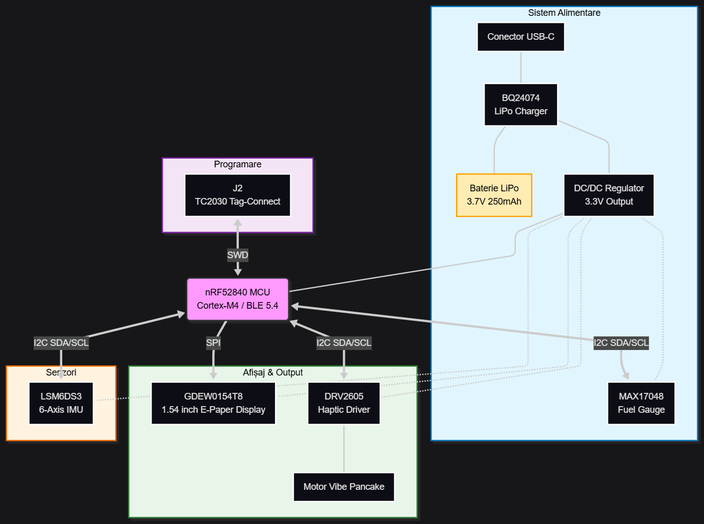

# InkTime Smartwatch Project

**InkTime** este un smartwatch conceptual bazat pe microcontrolerul **nRF52840**, proiectat pentru autonomie ridicată prin utilizarea unui ecran E-Paper și optimizarea consumului de energie.

---

## 1. Diagramă Bloc
Sistemul este organizat în jurul MCU-ului nRF52840, care gestionează comunicația cu senzorii via I2C și controlul ecranului via SPI.

## 2. Bill Of Materials (BOM)

| Componentă | Descriere | Furnizor (JLC Parts) | Datasheet |
| :--- | :--- | :--- | :--- |
| **nRF52840** | MCU Bluetooth 5.4, ARM Cortex-M4 | [C190733]() | [Link]() |
| **GDEW0154T8** | 1.54" E-Paper Display (SPI) | [JLC Search]() | [Link]() |
| **MAX17048** | Fuel Gauge (Monitorizare Baterie) | [C134045]() | [Link]() |
| **DRV2605** | Haptic Driver (LRA/ERM) | [C128456]() | [Link]() |
| **LSM6DS3** | IMU (Accelerometru & Giroscop) | [C133748]() | [Link]() |
| **BQ24074** | LiPo Charger via USB-C | [C111355]() | [Link]() |
| **LP502030** | Baterie LiPo 3.7V 250mAh | [N/A] | [Link]() |

---

## 3. Descriere Funcționalitate Hardware

### Module și Senzori
* **Microcontroler (MCU):** nRF52840 coordonează toate procesele. Acesta procesează datele de la senzorul de mișcare și actualizează imaginea pe ecranul E-Paper.
* **Afișaj E-Paper:** Conectat prin **SPI**. Avantajul principal este consumul zero de energie în stare statică (imaginea rămâne vizibilă fără alimentare).
* **Haptic Feedback:** Un motor de tip "pancake" (10mm) condus de driverul DRV2605 oferă notificări tactile.
* **Power Management:** Încărcarea se face prin USB-C. Tensiunea bateriei (VBAT) este monitorizată de MAX17048 (Fuel Gauge) pentru a afișa procentul exact al bateriei. Un regulator DC/DC asigură un prag stabil de **3.3V** pentru întreg sistemul.

### Calcule Consum (Estimativ)
* **Deep Sleep:** ~20 µA (Senzorii în low-power, MCU în System OFF).
* **Refresh Ecran:** 5-10 mA timp de aprox. 1.5 secunde.
* **Capacitate Baterie:** 250 mAh.
* **Autonomie:** La 10 refresh-uri/zi, autonomia depășește **30 de zile**.

---

## 4. Configurație Pini nRF52840

| Pin | Funcție | Destinație | Motiv |
| :--- | :--- | :--- | :--- |
| **P0.26** | SDA | I2C Bus | Comunicație date IMU, Fuel Gauge, Haptic. |
| **P0.27** | SCL | I2C Bus | Clock pentru magistrala I2C. |
| **P0.13** | SCK | SPI Bus | Semnal clock pentru ecranul E-Paper. |
| **P0.15** | CS | EPD | Chip Select pentru activarea ecranului. |
| **P1.01** | EN | Haptic | Activare driver motor vibrații. |
| **SWDIO** | Data | J2 (TC2030) | Pin programare și debugging (SWD). |
| **SWDCLK** | Clock | J2 (TC2030) | Pin ceas pentru programare (SWD). |

---

## 5. Detalii Design și Review

### Strategie de Rutare (PCB 4 Layere)
* **Lățime Trasee Alimentare:** Toate liniile de putere (3.3V, VBUS, VBAT) au fost rutate cu **0.3 mm** pentru a minimiza căderile de tensiune.
* **Layer Stack:**
    * **Layer 1 (Top):** Componente, semnale critice și plan de masă (GND Plane).
    * **Layer 2:** Plan dedicat de alimentare.
    * **Layer 63:** Trasee secundare de date.
    * **Layer 64 (Bottom):** Trasee de date și masă.
* **Test Pads:** S-au adăugat pad-uri SMD de 2mm pe stratul TOP pentru lipirea manuală a firelor bateriei (BAT+, GND) și a motorului haptic, respectând un clearance de 2mm pentru siguranță.

### Integrare Mecanică
* **Baterie:** Modelul LP502030 este plasat sub PCB. S-a prevăzut spațiu pentru izolarea cu bandă Kapton față de via-urile de pe stratul Bottom.
* **Shaker:** Motorul haptic este poziționat lângă mufa USB-C pentru a profita de spațiul oferit de înălțimea conectorului.

## 6. Erori DRC Ignorate (Waived Errors)

În urma verificării regulilor de design (Design Rule Check), următoarele erori au fost identificate și ignorate asumat, având în vedere constrângerile mecanice și de spațiu ale proiectului conceptual:

### Overlap (6 erori)
* **Localizare:** Cele 3 butoane laterale.
* **Descriere:** Fiecare buton prezintă câte 2 erori de overlap între via-urile de semnal și pinii mecanici ai componentei.
* **Justificare** Eroare cauzată de modul în care a fost creat footprint-ul butoanelor

### Copper Clearance (25 erori)
* **Localizare:** Zonele cu densitate mare de pini (nRF52840, Fuel Gauge).
* **Descriere:** Încălcarea distanței minime între trasee sau între traseu și pad.
* **Justificare:** Pentru a ieși cu rutarea de 0.15mm din zonele unde pinii sunt înconjurați de alte conexiuni, s-a prioritizat conectivitatea electrică în detrimentul padding-ului standard. Într-un proces de fabricație real, acest lucru ar necesita tehnologie de înaltă densitate (HDI).

### Board Outline Clearance (4 erori)
* **Localizare:** Conectorul USB-C.
* **Descriere:** Elemente de cupru/mecanice care ating sau depășesc conturul plăcii (Dimension layer).
* **Justificare:** Aceste erori fac parte din amprenta (footprint-ul) componentei USB-C pentru a permite montarea corectă a mufei la marginea carcasei. Sunt erori false generate de geometria specifică a conectorului.

Licensed under the [Apache 2.0](LICENSE).